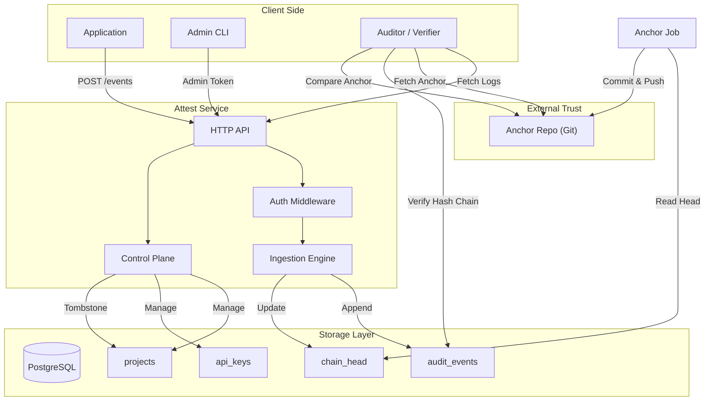

# System Architecture

## High-Level Design

Attest operates on a strict separation of concerns between **ingestion**, **storage**, and **verification**.

1.  **Ingestion (Writer)**:
    -   Clients submit events via HTTP API.
    -   The service authenticates the request via API Key.
    -   The service computes the cryptographic hash of the event payload and links it to the previous chain hash for the project.
    -   The event is appended to the database.

2.  **Storage (Database)**:
    -   **`audit_events`**: Stores the ordered log of events. Columns: `projectId`, `sequence`, `payloadJson`, `payloadHash`, `prevChainHash`, `chainHash`.
    -   **`chain_head`**: Stores the pointer to the latest event (`lastSequence`, `lastChainHash`) for optimistic locking and quick lookups.
    -   Updates to `chain_head` are serialized per project to ensure a single, linear history.

3.  **Anchoring (External)**:
    -   A background process periodically reads the `chain_head` of all projects.
    -   It writes an immutable summary (Anchor) to an external, append-only medium (e.g., a Git repository).
    -   This creates a checkpoint that cannot be altered by the database operator.
    -   The anchoring system is assumed to be outside the control of the Attest database operator.

4.  **Verification (Reader)**:
    -   Clients or auditors download the full event log from the service.
    -   They independently recompute the hash chain to verify internal consistency.
    -   They fetch the latest anchor from the external source.
    -   They verify that the local chain matches the anchored state.

5.  **Control Plane (Admin)**:
    -   Operators manage projects and API keys via a CLI.
    -   Protected by a high-entropy Admin Token.
    -   Handles lifecycle events: Project Creation, Key Rotation, Revocation, Tombstoning.

## Architecture Diagram

## Verification Model

Verification is the core value proposition of Attest. It consists of two layers:

### 1. Internal Consistency (`verifyChain`)
This step ensures that the database has not been corrupted by random bit rot or naive tampering.
-   Iterate through all events `e[0]` to `e[n]`.
-   Verify `e[i].prevChainHash == e[i-1].chainHash`.
-   Verify `e[i].chainHash == SHA256(e[i].prevChainHash + SHA256(e[i].payload))`.

**Guarantee**: If this passes, the log is internally consistent. However, it does *not* prove that the history is the original history if a sophisticated attacker recomputed all hashes. It provides **tamper-evidence** against naive corruption.

### 2. Anchor Verification (`verifyAgainstAnchor`)
This step defends against "split-view" attacks and history rewriting.
-   Fetch the trusted anchor for the project (e.g., from a separate Git repo).
-   The anchor contains `{ lastSequence: N, lastChainHash: H }`.
-   Locate event `N` in the local log.
-   Verify that `event[N].chainHash === H`.

**Guarantee**: If this passes, the log provided by the service matches the state that was previously committed to the external anchor.

Verification does not require trust in the Attest service at verification time.

## Anchoring: Design and Proof

### Why Anchoring is Necessary
A standard hash chain only proves that the current state is derived from *some* history. It does not prove that it is the *original* history. An attacker with database access can:
1.  Delete the last 10 events.
2.  Append 10 new malicious events.
3.  Recompute all subsequent hashes.
4.  Update the `chain_head`.

To a verifier, this rewritten chain looks perfectly valid. Anchoring solves this by publishing checkpoints to a system the attacker does not control.

### Adversarial Testing
This test models a strong attacker with long-term, unrestricted database access.

We validated this design against a "Strong Attacker" model. The attacker:
1.  Gained full access to the database.
2.  Modified a historical event (sequence 3).
3.  Recomputed the hash chain for all subsequent events.
4.  Updated the `chain_head` table.

**Results:**
-   **Internal Verification**: PASSED. The attacker successfully forged a valid hash chain.
-   **Anchor Verification**: FAILED. The recomputed chain hash at the anchor point did not match the hash stored in the external anchor file.

**Conclusion**: To successfully rewrite history, an attacker must compromise **both** the Attest database and the external anchoring system (e.g., rewrite Git history) simultaneously.

### Anchoring Lifecycle & Observability
The anchoring process is designed to be auditable itself.

1.  **Execution**: A cron job triggers the anchor script.
2.  **Logging**: The script logs its start time and status ("running") to the `anchor_runs` table.
3.  **Snapshot**: It reads the current chain head of all projects.
4.  **Commit**: It writes a JSON file and commits it to the local Git repo.
5.  **Push**: It pushes the commit to a remote Git repository (if configured).
6.  **Completion**: It updates the `anchor_runs` table with the commit hash and status ("success").

If any step fails (including the git push), the run is marked as "failed" in the `anchor_runs` table with the error message. This ensures that silent failures are detected.

**Note**: The `anchor_runs` table is for **observational monitoring only**. Verification tools do **not** trust this table; they rely exclusively on the external Git history.

### Why Git?
We use Git as the anchor storage medium because:
1.  **Merkle Tree Structure**: Git itself is a Merkle tree. Every commit hash cryptographically depends on the entire history of the repository. Rewriting an old anchor requires rewriting all subsequent Git commits.
2.  **Distributed Nature**: The anchor repository can be easily replicated to multiple offline or off-site locations (GitHub, GitLab, local backup server).
3.  **Auditability**: Git provides standard, well-understood tools (`git log`, `git show`) for inspecting history. No custom verification tooling is needed to prove that the anchor file existed at a specific point in time.
4.  **Simplicity**: It avoids the complexity and cost of a blockchain while providing similar immutability guarantees for this specific use case.

## Concurrency, Throughput, and Integrity Tradeoffs

### Serialization
Attest enforces strict serialization of writes per project. This is a deliberate design choice, not a limitation.
-   **Why**: To guarantee a linear, verifiable hash chain (`prevChainHash` -> `chainHash`), every event must cryptographically depend on the immediately preceding event.
-   **Tradeoff**: Parallel writes are impossible within a single project. Throughput is limited by the latency of a single database round-trip.

### Throughput Scaling
-   **Horizontal Scaling**: Throughput scales linearly with the number of *projects*. Since projects are isolated, they do not contend for the same lock.
-   **Batching**: To increase throughput within a single project, clients should batch multiple logical actions into a single Attest event payload, or use an upstream queue to buffer bursts.
-   **Queues**: Attest does not use internal queues (Kafka, RabbitMQ) for ingestion. Queues hide failures and make "at-most-once" vs "at-least-once" guarantees ambiguous. Attest provides **synchronous, explicit confirmation**: if you get a 201, it is written. If you get a 429 or 500, it is not.

### Rate Limiting
Rate limiting exists to protect availability, not integrity.

Attest enforces rate limits at multiple layers to prevent abuse, runaway clients, and accidental overload, while preserving the cryptographic guarantees of the audit log.

#### Design Principles

-   **Availability over throughput**: Rejecting a request (429) preserves the integrity of the chain. Accepting a request and failing to write it (partial failure) would compromise it.
-   **Integrity is never compromised**: Attest never partially writes events. A request is either:
    -   fully accepted and cryptographically committed, or
    -   rejected before any mutation occurs.
-   **Explicit failure model**: Rate limit exhaustion returns an immediate HTTP 429. The client is responsible for retrying or failing safe. Attest never silently drops events.

#### Why Rate Limiting is Safe for Audit Logs
-   **Immutability**: Only successfully accepted requests affect the hash chain.
-   **No gaps**: Rejected requests do not create missing sequence numbers.
-   **Deterministic behavior**: Every accepted event is permanently verifiable.

Rate limiting may reduce *throughput*, but it never weakens *integrity*.
